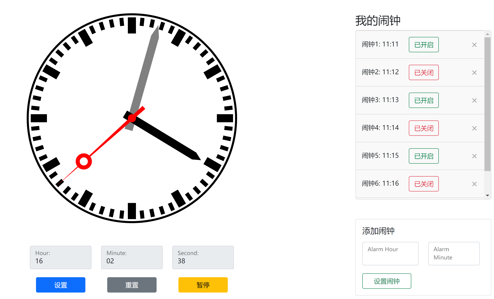
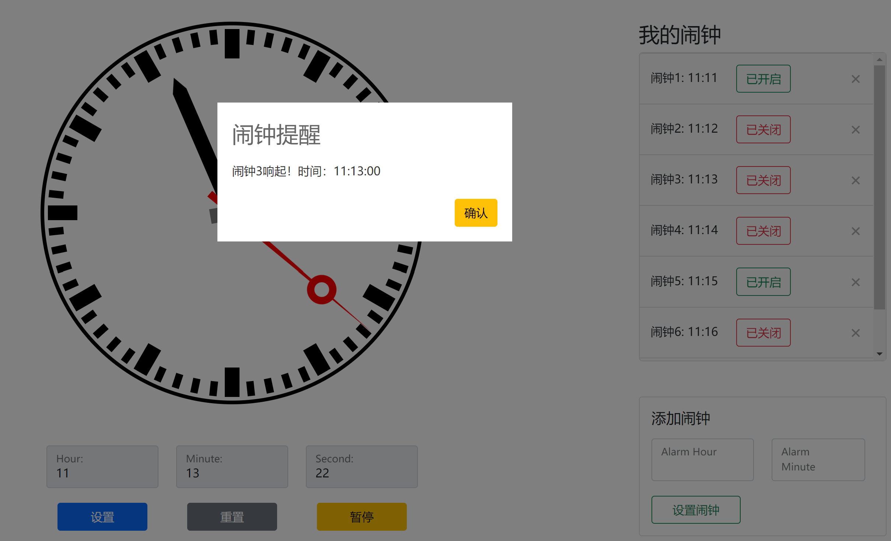
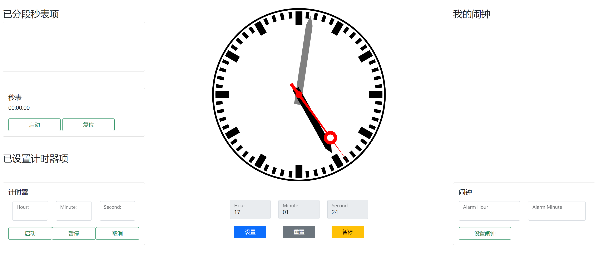

# 大作业选题二：可交互时钟

杨之凡 2022012065 yangzf22@mails.tsinghua.edu.cn
徐浩然 2022012082
杨憬晗 2022010808
赵涵远 2022010818

## 实现思路

### 时钟表盘设计

实验要求使用SVG设计一个具有时针、分针和秒针的可交互时钟，因此考虑使用SVG的`<circle>`与`<path>`进行排列组合，首先实现一个静态的时钟表盘，在基础的样式设计完成后，再考虑使用`javascript`脚本对时钟的时针、分针、秒针进行编程，控制它们的运动。


这一部分的SVG代码如下：

```svg
<svg viewbox="0 0 520 540">
    <!-- 圆心是(260,260)最底层 -->
    <circle cx="260" cy="260" r="260" fill="black"></circle>
    <circle cx="260" cy="260" r="255" fill="white"></circle>
    <!-- 刻度，其他元素的绘制要借助循环 -->
    <!-- 次底层 -->
    <path class="second_scale" fill="black" d="M 265 10 L 265 30 L 255 30 L 255 10 L 265 10 Z"></path>
    <!-- 整点次次底层 -->
    <path class="hour_scale" fill="black" d="M 270 10 L 270 50 L 250 50 L 250 10 L 270 10 Z"></path>

    <!-- 分针 -->
    <path id="minute_hand" fill="grey"
          d="M 260 20 L 270 50 L 270 290 L 250 290 L 250 50 L 260 20 Z"></path>
    <!-- 时针 -->
    <path id="hour_hand" fill="black" d="M 260 60 L 270 80 L 270 280 L 250 280 L 250 80 L 260 60 Z">
    </path>
    <!-- 秒针整体 -->
    <path class="second_hand" fill="red" d="M 260 10 L 265 300 L 255 300 L 260 10 Z"></path>
    <circle class="second_hand" cx="260" cy="100" r="20" fill="red"></circle>
    <circle class="second_hand" cx="260" cy="100" r="10" fill="white"></circle>

    <!-- 用于提示哪里是圆心 -->
    <circle cx="260" cy="260" r="10" fill="red"></circle>
</svg>
```

首先绘制时钟的`border`，即圆盘的底层。我们充分发挥SVG的优势，使用相对定位固定元素，保证了在容器大小发生改变的情况下我们的表盘的基本形状与元素也不会发生改变。在这之后绘制刻度、时针、分针、秒针等元素，从而实现了一个静态的时钟表盘样式效果。其中，较为重复的刻度我们采用脚本进行绘制。

### 时针、分针、秒针的可编程运动

为了实现SVG中时针、分针、秒针的平滑运动，我们选择使用CSS中的动画属性，利用`rotate` function来设置元素的角度。

```css
{
    --degree: 0deg;
    transform-origin: 260px 260px;
    transition-property: all;
    transition-timing-function: linear;
    transition-duration: .5s;
    transform: rotate(var(--degree));
}
```

在`javascript`代码中，我们设置一个间隔为`1000ms`的`interval`，每次触发此`interval`时，就会计算出每个针元素需要旋转的角度，又由于我们在CSS中设置了其动画为线性插值模式，所以在这`1000ms`内，可以让针元素平滑地运动到指定的位置。值得一提的是，`rotate`设置的角度是“旋转到某一角度”，因此如果经过`360`时，针会先逆时针旋转。为解决这一问题，我们记录每个针所走的圈数以保证旋转时设定的角度是递增的。重新设定或者刷新网页后，我们会清空记录的圈数以保证设置的角度是正确的。

```javascript
// 获取时、分、秒
let seconds = current.getSeconds();
let minutes = current.getMinutes();
let hours = current.getHours() % 12;

// 计算当圈的角度（<360）
let angleOfSecond = 6 * seconds;
let angleOfMinute = 6 * (minutes + seconds / 60);
let angleOfHour = 30 * (hours + (minutes + seconds / 60) / 60);

// 新的一圈更新圈数
if (angleOfSecond === 0) {
    sessionStorage.setItem('turnsOfSecond', turnsOfSecond + 1);
}
if (angleOfMinute === 0) {
    sessionStorage.setItem('turnsOfMinute', turnsOfMinute + 1);
}
if (angleOfHour === 0) {
    sessionStorage.setItem('turnsOfHour', turnsOfHour + 1);
}
// 获取圈数
turnsOfSecond = Number(sessionStorage.getItem('turnsOfSecond'));
turnsOfMinute = Number(sessionStorage.getItem('turnsOfMinute'));
turnsOfHour = Number(sessionStorage.getItem('turnsOfHour'));

// rotate的角度必须是保证单调递增的，一旦减小就会逆时针旋转
for (const item of secondHands) {
    item.style.setProperty('--degree', `${angleOfSecond + 360 * turnsOfSecond}deg`);
}
minuteHand.style.setProperty('--degree', `${angleOfMinute + 360 * turnsOfMinute}deg`);
hourHand.style.setProperty('--degree', `${angleOfHour + 360 * turnsOfHour}deg`);
```

通过获取变量`current`的时、分、秒，即下一时刻表盘中的针元素应当转到的位置，由此计算需要转动的角度，再通过`style.setProperty`来设置`--degree`，在下一个`1000ms`事件到来时，可以保证针元素已转过给定的角度。

### 闹钟

考虑闹钟与时钟本身的关联性，在时钟页面设置了用于存放闹钟列表与“添加闹钟”功能的侧边栏，并对所设置的每个闹钟添加了可重复性检测。



这一部分的html代码如下：

```html
<!-- 闹钟侧边栏区域 -->
<div class="col-md-3 alarmContainer">
    <div class="mt-5">
        <h3>我的闹钟</h3>
        <div id="alarmList" class="list-group">
            <!-- 闹钟项将被动态添加到这个列表中 -->
        </div>
    </div>
    <!-- 闹钟设置控件 -->
    <div class="card mt-5">
        <div class="card-body">
            <h5 class="card-title">闹钟</h5>
            <div class="row mt-3">
                <div class="col-md-6" style="padding: 0 12px 0 0">
                    <form class="form-floating">
                        <input type="text" class="form-control" maxlength="2" minlength="2" id="alarm_hour"
                            inputmode="numeric" pattern="(?:[0-1][0-9]|2[0-3])">
                        <label for="hour_place">Alarm Hour</label>
                    </form>
                </div>
                <div class="col-md-6">
                    <form class="form-floating">
                        <input type="text" class="form-control" maxlength="2" minlength="2"
                            id="alarm_minute" inputmode="numeric" pattern="[0-5][0-9]">
                        <label for="hour_place">Alarm Minute</label>
                    </form>
                </div>
            </div>
            <button type="button" class="btn btn-outline-success myBtn" id="set_alarm" style="width: 40%">
                设置闹钟
            </button>
        </div>
    </div>
</div>
```

当使用“添加闹钟”功能设立新闹钟后，闹钟项将被动态添加到闹钟列表中，初始化状态为“已开启”，并进行实时更新。当对应时间的闹钟响起后，将弹出模态对话框提示用户相关信息，点击“确认”即可关闭该闹钟，并更新其状态为“已关闭”。

```js
// 触发特定闹钟提醒
function triggerAlarm(alarmTimeIndex) {
    const alarmTime = alarmTimes[alarmTimeIndex];
    // 播放音频
    var audio = document.getElementById('alarmSound');
    audio.play();
    // 获取模态对话框元素
    var dialog = document.querySelector('.dialog-component');
    // 显示模态对话框
    dialog.style.display = 'block';
    // 更新模态对话框中的提醒信息
    document.querySelector('.dialog-container').textContent = `闹钟${alarmTimeIndex + 1}响起！时间：${new Date(alarmTime.dateTime).toLocaleTimeString()}`;
    // 为关闭按钮添加事件监听器
    document.getElementById('dialogSureBtn').addEventListener('click', function () {
        // 隐藏模态对话框
        dialog.style.display = 'none';
        // 停止音频
        audio.pause();
    });
    alarmTimes[alarmTimeIndex].active = false;
    updateAlarmDisplay();
}
```



### 秒表&计时器

考虑整体页面的美观，在主页面设置了用于存放秒表功能和计时器功能的侧边栏。



这一部分的html代码如下：

```html
<!-- 秒表与计时器侧边栏区域 -->
<div class="col-md-3 stopWatch_timer_Container">
    <div class="mt-5">
        <h3>已分段秒表项</h3>
        <div id="stopWatchList" class="list-group">
            <!-- 秒表项将被动态添加到这个列表中 -->
        </div>
    </div>
    <!-- 秒表设置控件 -->
    <div class="card mt-5">
        <div class="card-body">
            <h5 class="card-title">秒表</h5>
            <div id="stopWatchDisplay" class="mt-2">00:00.00</div>
            <button type="button" class="btn btn-outline-success myBtn" id="start_stopWatch"
                style="width: 40%">
                启动
            </button>
            <button type="button" class="btn btn-outline-success myBtn" id="reset_stopWatch"
                style="width: 40%">
                复位
            </button>
        </div>
    </div>

    <div class="mt-5">
        <h3>已设置计时器项</h3>
        <div id="TimerList" class="list-group">
            <!-- 计时器项将被动态添加到这个列表中 -->
        </div>
    </div>

    <!-- 计时器设置控件 -->
    <div class="card mt-5">
        <div class="card-body">
            <h5 class="card-title">计时器</h5>
            <!-- <div id="TimerDisplay" class="mt-2">00:00:00</div> -->
            <!-- 控件 -->
            <div class="row justify-content-center">
                <div class="col-md-4 mt-2">
                    <form class="form-floating">
                        <input type="text" class="form-control" maxlength="2" minlength="2"
                            id="hour_place_timer" inputmode="numeric" pattern="(?:[0-1][0-9]|2[0-3])">
                        <label for="hour_place_timer">Hour:</label>
                    </form>
                </div>
                <div class="col-md-4 mt-2">
                    <form class="form-floating">
                        <input type="text" class="form-control" maxlength="2" minlength="2"
                            id="minute_place_timer" inputmode="numeric" pattern="[0-5][0-9]">
                        <label for="minute_place_timer">Minute:</label>
                    </form>
                </div>
                <div class="col-md-4 mt-2">
                    <form class="form-floating">
                        <input type="text" class="form-control" maxlength="2" minlength="2"
                            id="second_place_timer" inputmode="numeric" pattern="[0-5][0-9]">
                        <label for="second_place_timer">Second:</label>
                    </form>
                </div>

            </div>
            <div class="row justify-content-between">
                <button type="button" class="btn btn-outline-success myBtn col" id="start_timer"
                    >
                    启动
                </button>
                <button type="button" class="btn btn-outline-success myBtn col" id="pause_timer"
                    >
                    暂停
                </button>
                <button type="button" class="btn btn-outline-success myBtn col" id="cancel_timer"
                    >
                    取消
                </button>
            </div>

        </div>
    </div>

</div>
```

### 用户交互

为了让本SVG项目有现代前端工程的用户体验，我们使用了`Bootstrap 5`框架来进行前端的总体搭建。我们使用`Bootstrap 5`中的网格系统和其它控件与样式以实现一个**响应式**的页面。

#### PC端


当屏幕大小发生变化时，时钟与其他元素也应该有自适应屏幕大小的能力。现在进行移动端页面的媒体选择调试：

#### iPhone 12 Pro


#### iPad Pro


## 使用说明

本项目为静态网页项目，所有资源中的路径都是相对路径，可以通过直接打开`index.html`进行使用。本项目的
目录结构如下：

```text
doc/            存放与report.pdf文档有关的资源
scripts/        存放网页中使用的脚本文件
styles/         存放网页中使用的样式表文件
index.html      主页面
report.pdf      报告
```
#### 时钟
进入页面后默认显示的是实时时间，想要手动设定时间需要首先先点击暂停键。点击暂停键后，可在编辑框中输入或拨动表针设定时间。需要注意的是，设置完成后请务必点击“设置”后再点击继续，否则设定时间不会生效，显示的仍为实时时间。重置按钮无论在暂停或者是非暂停时都会生效，重置后将恢复为实时时间。

#### 秒表
点击“秒表”项的“启动”按钮，秒表将开始运作，同时“启动”按钮更新为“暂停”，“复位”按钮更新为“分段”。点击“分段”按钮，可逐次更新前后截取分段时间，并更新到上方的“已分段秒表项”显示区域，并对各段时间进行大小统计，时间最长者以红色显示，最短者以绿色显示，符合日常使用需求。点击“暂停”按钮，可暂停秒表运作，此时“分段”按钮更新为“复位”，点击“复位”按钮，即可重置秒表并清空已分段秒表项。

#### 计时器
在“计时器”项的时、分、秒文本框中输入合法时间后，如“01:03:20”（1小时3分钟20秒），点击“启动”按钮，即可开启倒计时，点击“暂停”按钮，即可暂停倒计时，同时“暂停”按钮更新为“继续”，再次点击可恢复倒计时，点击“取消”即可取消倒计时项。

## 遇到问题与解决办法

### 如何存储中间状态

使用`sessionStorage`存储中间状态。与`localStorage`不同，`sessionStorage`仅在页面会话期间存储数据，一旦页面被关闭，数据就会被清除。因此，使用`sessionStorage`可以确保页面退出后时间信息不保留。

### 秒针有的时候会一次跳两格

使用`console.log`进行大量调试、重构状态机。经过调试，问题出现的代码如下：
```javascript
let setTime = new Date(current.toString().replace(timeRegex, sessionStorage.getItem('setTime')));
```
利用正则表达式将存储在`sessionStorage`中的时间设置成当前时间时，所得到的`setTime`并不能包含末三位的信息，即毫秒位均为`0`。与此同时，由于其他程序的存在，`setInterval`函数并不能保证两次调用`Date.now()`之间恰好间隔`1000ms`，存在`1~2ms`的误差，这会导致`setTime`因进位退位而发生秒数异常。经检验，本实验添加`offset`，使得`setTime`展示的时间与当前时间的毫秒位对齐，进而避免了秒数异常的问题。代码如下:
```javascript
current = new Date();
let offset = current.getTime() % 1000;
let setTime = new Date(current.toString().replace(timeRegex, sessionStorage.getItem('setTime')));
...
// 更新后的时间
current = new Date(setTime.getTime() + offset + deltaTime + ...);
```

### 时针跟随移动状态存在异常
总结错误情形，重构设置逻辑。为使拨动钟表修改时间符合一般钟表的逻辑，实验添加了拨动时针时分针转动，拨动秒针时其余两个指针均跟随转动的功能。然而这样的设计会在具体调节中产生冲突。

在正常的钟表运作中，时针的位置与分针秒针相对应，譬如`11:59`时针接近于`12`点方向，`11:01`时时针接近`11`点方向，只有这样的时针位置才是合法位置。经调试与检验，我们发现在用户随意拨动后，钟表中的指针不一定位于合法的位置。譬如先拨动时针，但不超过一个小时，此时调节时间的系统并不会识别到用户的拨动，仍然停留在原始时间，但时针位置发生了变化。倘若调节前时针位置是合法的，新位置便不会在正常运作的钟表中出现。不合法的位置会破坏预设的时钟逻辑并产生错误。

为使得先前的拨动不会影响到后续的时间拨动和时钟运行，本实验在每次放下指针时将钟表的位置重置为合法位置，即数字表盘对应的位置。代码如下:
```javascript
function endDrag() {
        ...

        //更新时间
        let setHour = hourPlace.value;
        let setMinute = minutePlace.value;
        let setSecond = secondPlace.value;

        let angleOfSecond = 6 * Number(setSecond);
        let angleOfMinute = 6 * (Number(setMinute) + Number(setSecond) / 60);
        let angleOfHour = 30 * (Number(setHour) % 12 + (Number(setMinute) + Number(setSecond) / 60) / 60);

        for (const item of secondHands) {
            item.style.setProperty('--degree', `${angleOfSecond}deg`);
        }
        minuteHand.style.setProperty('--degree', `${angleOfMinute}deg`);
        hourHand.style.setProperty('--degree', `${angleOfHour}deg`);
        ...
    }
```

### SVG的大小无法改变
查看文档，改变父容器的布局。
