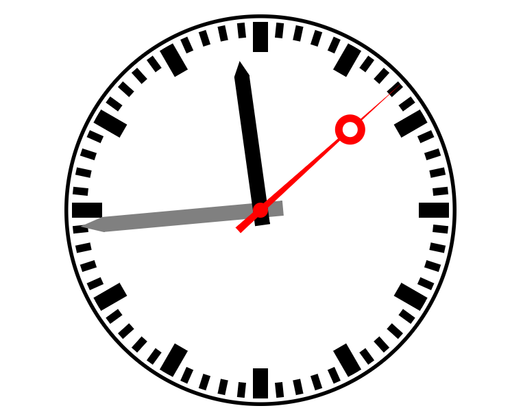
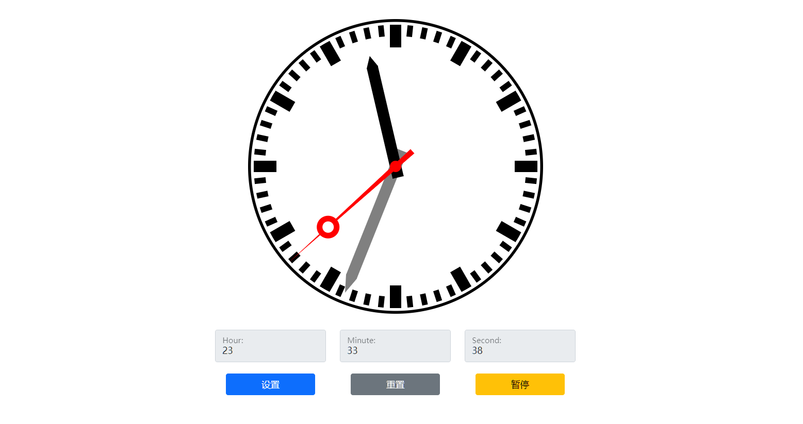
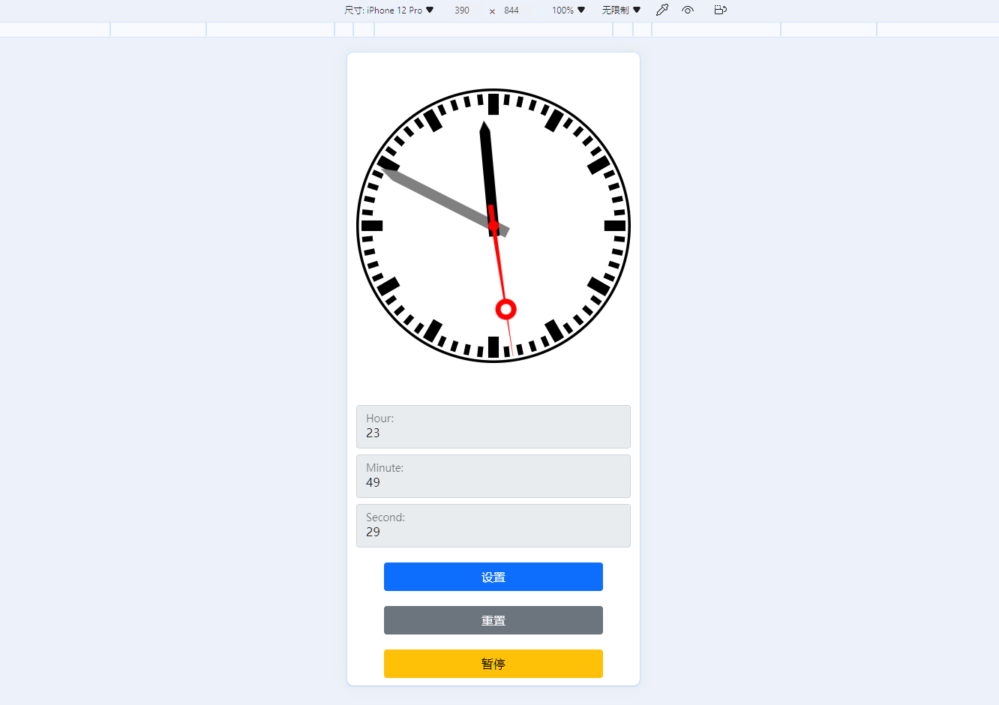
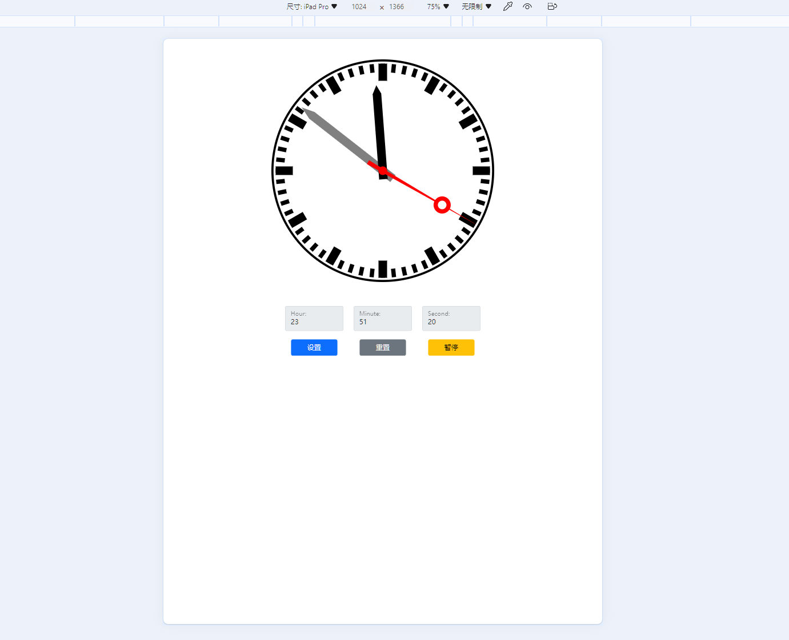

# 大作业选题二：可交互时钟

## Overview

### 已实现功能：

* 显示实时时间
* 输入设置时间

### 待实现功能：

* 闹钟 ()
* 拖动表针设置时间 (徐浩然)
* CSS样式优化 ()

## 实现思路

### 时钟表盘设计

实验要求使用SVG设计一个具有时针、分针和秒针的可交互时钟，因此考虑使用SVG的`<circle>`与`<path>`进行排列组合，首先实现一个
静态的时钟表盘，在基础的样式设计完成后，再考虑使用`javascript`脚本对时钟的时针、分针、秒针进行编程，控制它们的运动。



这一部分的SVG代码如下：

```svg
<svg viewbox="0 0 520 540">
    <!-- 圆心是(260,260)最底层 -->
    <circle cx="260" cy="260" r="260" fill="black"></circle>
    <circle cx="260" cy="260" r="255" fill="white"></circle>
    <!-- 刻度，其他元素的绘制要借助循环 -->
    <!-- 次底层 -->
    <path class="second_scale" fill="black" d="M 265 10 L 265 30 L 255 30 L 255 10 L 265 10 Z"></path>
    <!-- 整点次次底层 -->
    <path class="hour_scale" fill="black" d="M 270 10 L 270 50 L 250 50 L 250 10 L 270 10 Z"></path>

    <!-- 分针 -->
    <path id="minute_hand" fill="grey"
          d="M 260 20 L 270 50 L 270 290 L 250 290 L 250 50 L 260 20 Z"></path>
    <!-- 时针 -->
    <path id="hour_hand" fill="black" d="M 260 60 L 270 80 L 270 280 L 250 280 L 250 80 L 260 60 Z">
    </path>
    <!-- 秒针整体 -->
    <path class="second_hand" fill="red" d="M 260 10 L 265 300 L 255 300 L 260 10 Z"></path>
    <circle class="second_hand" cx="260" cy="100" r="20" fill="red"></circle>
    <circle class="second_hand" cx="260" cy="100" r="10" fill="white"></circle>

    <!-- 用于提示哪里是圆心 -->
    <circle cx="260" cy="260" r="10" fill="red"></circle>
</svg>
```

首先绘制时钟的`border`，即圆盘的底层。我们充分发挥SVG的优势，使用相对定位固定元素，保证了在容器大小发生改变的情况下我们
的表盘的基本形状与元素也不会发生改变。在这之后绘制刻度、时针、分针、秒针等元素，从而实现了一个静态的时钟表盘样式效果。

### 时针、分针、秒针的可编程运动

为了实现SVG中时针、分针、秒针的平滑运动，我们选择使用CSS中的动画属性，利用`rotate` function来设置元素的旋转。

```css
{
    --degree: 0deg;
    transform-origin: 260px 260px;
    transition-property: all;
    transition-timing-function: linear;
    transition-duration: .5s;
    transform: rotate(var(--degree));
}
```

在`javascript`代码中，我们设置一个间隔为`1000ms`的`interval`，每次触发此`interval`时，就会计算出每个针元素需要
旋转的角度，又由于我们在CSS中设置了其动画为线性插值模式，所以在这`1000ms`内，可以让针元素平滑地运动到指定的位置。

```javascript
// 获取时、分、秒
let seconds = current.getSeconds();
let minutes = current.getMinutes();
let hours = current.getHours() % 12;

// 计算当圈的角度（<360）
let angleOfSecond = 6 * seconds;
let angleOfMinute = 6 * (minutes + seconds / 60);
let angleOfHour = 30 * (hours + (minutes + seconds / 60) / 60);

// 新的一圈更新圈数
if (angleOfSecond === 0) {
    sessionStorage.setItem('turnsOfSecond', turnsOfSecond + 1);
}

if (angleOfMinute === 0) {
    sessionStorage.setItem('turnsOfMinute', turnsOfMinute + 1);
}

if (angleOfHour === 0) {
    sessionStorage.setItem('turnsOfHour', turnsOfHour + 1);
}
// 获取圈数
turnsOfSecond = Number(sessionStorage.getItem('turnsOfSecond'));
turnsOfMinute = Number(sessionStorage.getItem('turnsOfMinute'));
turnsOfHour = Number(sessionStorage.getItem('turnsOfHour'));

// rotate的角度必须是保证单调递增的，一旦减小就会逆时针旋转

for (const item of secondHands) {
    item.style.setProperty('--degree', `${angleOfSecond + 360 * turnsOfSecond}deg`);
}
minuteHand.style.setProperty('--degree', `${angleOfMinute + 360 * turnsOfMinute}deg`);
hourHand.style.setProperty('--degree', `${angleOfHour + 360 * turnsOfHour}deg`);
```

通过获取变量`current`的时、分、秒，即下一时刻表盘中的针元素应当转到的位置，由此计算需要转动的
角度，再通过`style.setProperty`来设置`--degree`，在下一个`1000ms`事件到来时，可以保证针元素
已转过给定的角度。

### 用户交互

为了让本SVG项目有现代前端工程的用户体验，我们使用了Bootstrap 5框架来进行前端的总体搭建。我们使用
Bootstrap 5中的网格系统和其它控件与样式以实现一个**响应式**的页面。

#### PC端



当屏幕大小发生变化时，时钟与其他元素也应该有自适应屏幕大小的能力。现在进行移动端页面的媒体选择调试：

#### iPhone 12 Pro



#### iPad Pro



## 使用说明

本项目为静态网页项目，所有资源中的路径都是相对路径，可以通过直接打开`index.html`进行使用。本项目的
目录结构如下：

```text
doc/            存放与report.pdf文档有关的资源
scripts/        存放网页中使用的脚本文件
styles/         存放网页中使用的样式表文件
index.html      主页面
report.pdf      报告
```

## 遇到问题与解决办法

### 如何存储中间状态

使用sessionStorage

### 秒针有的时候会一次跳两格

重构状态机、使用`console.log`进行大量调试

### SVG的大小无法改变

查看文档，改变父容器的布局
